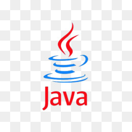

## About

I'm Thais Maiolino and here you can find a little bit more about me.

I am a Software developer and at this moment I work building tools to help clients lives. They show me up their big problems and I try to automatize their jobs or at least give them a easier way to performance their needs.

And of course, life isn't just about work. That's why on my free time you can find me in some tennis court, or wacthing some series, or coding something (my lastest coding was about developing an algorithm to win the Mega-Sena(Brazilian lucky game) but it didn't work properly... who knows some day?)

## Skills

 Python
 Java
 JavaScript
 Versioning (Git/SVN)

